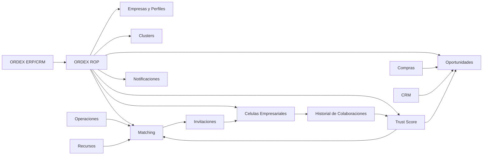
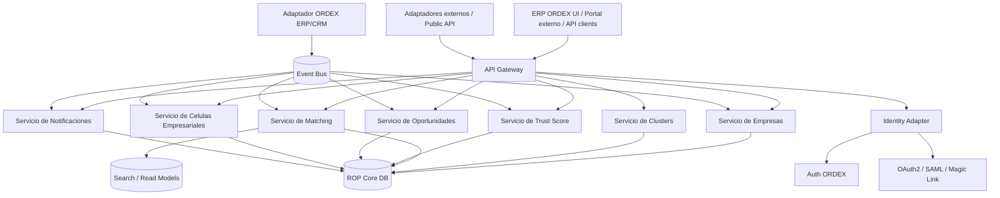
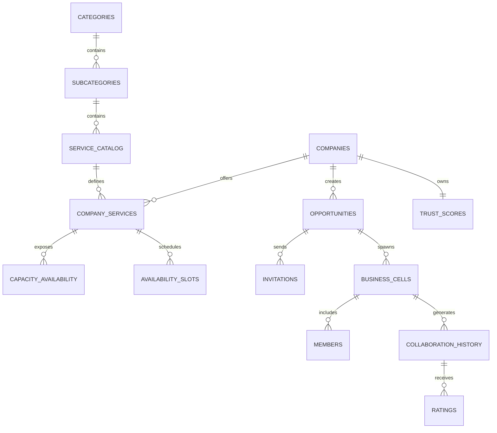
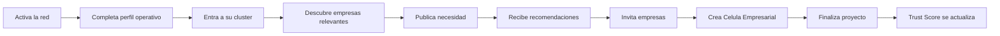
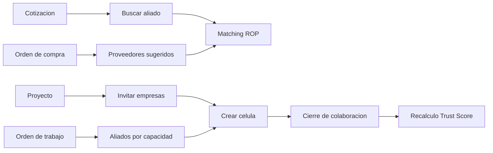

# ORDEX ROP - PRD Maestro

Documento rector para definir la visión, arquitectura funcional, arquitectura técnica y modelo de datos de ORDEX ROP, la Red Operativa para PYMES de Latinoamérica integrada en ORDEX.

ORDEX ROP no es una red social profesional ni un directorio estático. Es una red operativa transaccional donde empresas descubren capacidad real, colaboran dentro del flujo de trabajo y construyen confianza a partir de operaciones verificables.

## 1. Resumen ejecutivo

ORDEX ROP nace para resolver una fricción estructural en las PYMES de Latinoamérica: encontrar proveedores confiables, validar disponibilidad real, coordinar entregables entre varias empresas y generar negocio sin salir del ERP.

La propuesta de valor central es convertir a ORDEX en la capa operativa donde una empresa puede:

- descubrir aliados productivos por nicho y territorio,
- detectar capacidad disponible en tiempo casi real,
- abrir células empresariales compartidas para ejecutar trabajo conjunto,
- medir confianza usando evidencia operativa, no marketing declarativo,
- generar oportunidades recomendadas según demanda, oferta y contexto.

La tesis de producto es simple: la siguiente ventaja competitiva del ERP PYME no será solo registrar operaciones, sino orquestar redes productivas.

## 2. Problema y oportunidad

### Problemas actuales

- Las PYMES dependen de WhatsApp, llamadas y hojas de cálculo para encontrar proveedores o aliados.
- La disponibilidad real de capacidad no es visible ni estandarizada.
- La reputación entre empresas está basada en referencias informales, no en datos transaccionales.
- La coordinación entre empresas se hace fuera del sistema, generando pérdida de contexto, trazabilidad y velocidad.
- Las oportunidades de negocio no se distribuyen según fit operativo, sino por relaciones personales o búsqueda manual.

### Oportunidad

ORDEX ya concentra señales de CRM, ventas, operaciones, compras, inventario y órdenes. Esa posición le permite convertirse en el sistema nervioso que conecta oferta y demanda operativa entre empresas, con contexto verificable y ejecución trazable.

## 3. Visión del producto

### Visión

Construir la red operativa B2B de referencia para PYMES de Latinoamérica, donde las empresas colaboren, se abastezcan, ejecuten trabajo conjunto y generen negocio sin salir del ERP.

### Misión

Reducir el tiempo, el riesgo y el costo de colaborar entre empresas mediante una red operativa integrada, confiable y accionable.

### Posicionamiento

ORDEX ROP es una red operativa embebida en el ERP/CRM. No compite con redes sociales profesionales. Compite contra la descoordinación, el sourcing manual y la falta de trazabilidad interempresarial.

### Principios de producto

- Operación antes que conversación.
- Confianza basada en evidencia, no en perfiles decorativos.
- Matching accionable, no listados infinitos.
- Multiempresa y multisede desde el diseño.
- APIs y eventos públicos para desacoplar la red del ERP core.
- Datos públicos mínimos y datos privados protegidos por tenant, scope y consentimiento.

## 4. Objetivos y no objetivos

### Objetivos estratégicos

1. Aumentar la velocidad con la que una empresa encuentra proveedores o aliados aptos.
2. Reducir fallas operativas derivadas de proveedores no verificados o sin capacidad real.
3. Crear una capa de confianza interempresarial medible y reusable.
4. Generar oportunidades calificadas con probabilidad alta de ejecución.
5. Convertir a ORDEX en infraestructura de colaboración B2B, no solo en software interno.

### Objetivos de producto a 12 meses

1. Lanzar red operativa multiempresa con matching inicial por nicho, ubicación y capacidad.
2. Habilitar células empresariales compartidas con tareas, archivos, hitos y visibilidad controlada.
3. Calcular Trust Score con señales de cumplimiento, tiempos, repetición y calidad.
4. Desplegar motor de oportunidades recomendadas para supply, subcontratación y negocio cruzado.
5. Publicar API externa para onboarding de empresas no usuarias del ERP completo.

### No objetivos

- No construir un feed social ni muro de publicaciones.
- No ser un marketplace abierto con pujas anónimas en la primera fase.
- No reemplazar compras, CRM u órdenes del ERP; ORDEX ROP los amplifica.
- No mostrar información sensible sin consentimiento o política explícita de visibilidad.

## 5. Usuarios objetivo

### Persona 1. Gerente PYME

- Necesita resolver capacidad, proveedores y alianzas sin perder control.
- Valora confianza, velocidad de respuesta y visibilidad ejecutiva.
- Usa ORDEX ROP para descubrir aliados, revisar Trust Score y aceptar oportunidades.

### Persona 2. Coordinador de compras / abastecimiento

- Necesita encontrar proveedores confiables con capacidad compatible.
- Valora disponibilidad, tiempos de entrega, historial y condiciones.
- Usa ORDEX ROP para sourcing, invitaciones y comparación operativa.

### Persona 3. Coordinador operativo / producción

- Necesita derivar carga, subcontratar picos de trabajo o formar células temporales.
- Valora capacidad instalada, SLA y trazabilidad de entregables.
- Usa ORDEX ROP para compartir trabajo, definir hitos y monitorear cumplimiento.

### Persona 4. Comercial B2B

- Necesita convertir oportunidades en alianzas o ventas entre empresas.
- Valora recomendaciones, coincidencia de nicho y rapidez de cierre.
- Usa ORDEX ROP para activar oportunidades sugeridas y abrir células.

### Persona 5. Empresa externa no usuaria del ERP completo

- Quiere participar en la red con un footprint liviano.
- Valora onboarding simple, perfil operativo y acceso a oportunidades.
- Usa ORDEX ROP como servicio independiente con portal y APIs.

## 6. Jobs to be done

- Cuando tengo una orden o necesidad urgente, quiero encontrar proveedores con capacidad real para no detener la operación.
- Cuando tengo capacidad ociosa, quiero recibir oportunidades alineadas a mi nicho para monetizarla.
- Cuando debo ejecutar trabajo con otras empresas, quiero compartir contexto, tareas y entregables sin salir del sistema.
- Cuando evalúo a un proveedor, quiero una señal de confianza basada en operaciones previas y no solo en referencias.
- Cuando administro varias sedes o empresas, quiero ver qué relaciones colaborativas generan más cumplimiento y rentabilidad.

## 7. Casos de uso prioritarios

### CU1. Descubrimiento operativo de proveedores

Una empresa publica una necesidad de servicio o abastecimiento. ORDEX ROP encuentra empresas compatibles según categoría, subcategoría, geografía, capacidad disponible, SLA histórico y Trust Score.

### CU2. Matching automático para picos de demanda

Ante saturación interna, el sistema detecta capacidad insuficiente y recomienda aliados operativos cercanos o ya validados.

### CU3. Célula empresarial compartida

Dos o más empresas crean un espacio de trabajo compartido para ejecutar un proyecto, pedido o cadena de suministro con hitos, archivos, comentarios operativos y trazabilidad de responsables.

### CU4. Oportunidades personalizadas

El sistema recomienda oportunidades de negocio a empresas que muestran capacidad compatible, desempeño confiable y contexto comercial favorable.

### CU5. Índice de confianza operativo

Cada empresa acumula un Trust Score compuesto por señales verificadas: cumplimiento de tiempos, aceptación de invitaciones, repetición de colaboraciones, calidad percibida, disputas y respuesta.

### CU6. Red externa desacoplada

Una empresa externa se registra sin contratar todos los módulos del ERP y participa en ORDEX ROP con identidad federada, perfil limitado y acceso controlado a oportunidades.

## 8. Propuesta de valor por capacidad

### 8.1 Conectar empresas por nichos

- Catálogo jerárquico por categorías, subcategorías y servicios.
- Clusters por industria, ciudad, capacidad y vertical.
- Perfiles operativos orientados a ejecución.

### 8.2 Encontrar proveedores automáticamente

- Matching por reglas y scoring.
- Recomendación basada en historial colaborativo y señales del ERP.
- Sourcing desde compras, órdenes, CRM u oportunidades.

### 8.3 Mostrar disponibilidad en tiempo real

- Ventanas de disponibilidad publicadas por servicio, sede y capacidad.
- Estados de capacidad: disponible, restringida, saturada, fuera de servicio.
- Actualización por API, UI o eventos desde operaciones.

### 8.4 Crear espacios de trabajo compartidos entre empresas

- Células empresariales con membresía, permisos, hitos, entregables y conversaciones operativas.
- Vinculación opcional a oportunidad, orden, remisión o proyecto.

### 8.5 Construir un índice de confianza

- Trust Score con componentes trazables.
- Explicabilidad por factor positivo o negativo.
- Versionado y snapshots para auditoría.

### 8.6 Generar oportunidades de negocio personalizadas

- Oportunidades sugeridas por fit de nicho, capacidad, zona y confiabilidad.
- Reglas de elegibilidad y prioridad.
- Feedback loop de aceptación, rechazo y conversión.

## 9. North Star y métricas clave

### North Star Metric

Colaboraciones interempresariales activas verificadas por mes.

Definición:

- Una colaboración activa verificada ocurre cuando dos o más empresas aceptan una interacción operativa dentro de ORDEX ROP y generan al menos un hito, invitación aceptada, oportunidad activa o trabajo compartido con trazabilidad.

### Métricas de entrada

- Tiempo medio para encontrar proveedor compatible.
- Tasa de aceptación de invitaciones.
- Porcentaje de matching con respuesta en menos de 24 horas.
- Capacidad publicada activa por empresa y por nicho.
- Empresas con perfil operativo completo.

### Métricas de resultado

- Colaboraciones creadas por mes.
- Valor bruto de oportunidades originadas en ORDEX ROP.
- Tasa de conversión de oportunidad a colaboración.
- Repetición de colaboración entre las mismas empresas.
- Reducción de incumplimientos por proveedor nuevo.

### Métricas de confianza

- Cobertura de Trust Score sobre empresas activas.
- Variación promedio del Trust Score tras colaboraciones.
- Disputas por cada 100 colaboraciones.
- Tiempo de resolución de incidencias colaborativas.

### Métricas de plataforma

- Empresas externas activas en la red.
- Número de integraciones activas por API/webhook.
- Latencia p95 del matching.
- Latencia p95 de consulta de disponibilidad.

## 10. Requisitos funcionales

### RF1. Identidad empresarial

- Registrar empresas con identidad multiempresa y multisede.
- Configurar visibilidad pública y privada por campo.
- Asociar categorías, subcategorías, servicios y cobertura geográfica.

### RF2. Clusters y segmentación

- Agrupar empresas en clusters por nicho, región, tamaño, vertical o capacidad.
- Permitir clusters curados por sistema y clusters administrados.

### RF3. Matching

- Buscar y recomendar empresas por intención operativa.
- Calcular score de matching con factores ponderados.
- Explicar por qué una empresa fue recomendada.

### RF4. Disponibilidad y capacidad

- Publicar capacidad disponible por servicio, sede y ventana temporal.
- Exponer estados en tiempo casi real.
- Consumir señales del ERP o integraciones externas.

### RF5. Oportunidades

- Crear oportunidades originadas manualmente, por reglas o por eventos.
- Invitar empresas compatibles.
- Registrar estado, valor potencial y feedback.

### RF6. Células empresariales

- Crear espacios de trabajo compartidos con membresías y roles.
- Adjuntar archivos, hitos y mensajes operativos.
- Vincular a entidades del ERP cuando aplique.

### RF7. Trust Score

- Calcular y versionar el Trust Score por empresa.
- Mostrar score agregado y factores explicativos.
- Aislar datos sensibles y reglas antifraude.

### RF8. Notificaciones

- Notificar invitaciones, oportunidades, cambios de capacidad, menciones y riesgos.
- Soportar in-app, email, push y webhooks.

## 11. Requisitos no funcionales

- Arquitectura multi-tenant con aislamiento por empresa.
- Soporte para empresas externas con autenticación federada u OAuth2.
- API-first y event-driven.
- Auditoría completa de colaboraciones, cambios de estado y score.
- Disponibilidad objetivo inicial de 99.5%.
- p95 de matching menor a 600 ms sobre índices calientes.
- Observabilidad con logs estructurados, métricas y trazas distribuidas.

## 12. Arquitectura funcional

ORDEX ROP se ubica como una capacidad transversal entre Captación, Ventas, Operaciones, Recursos y Analítica. Opera como red B2B y no como pantalla aislada.

### Módulos funcionales internos

1. Directorio operativo vivo: empresas, servicios, capacidades y clusters.
2. Discovery y matching: búsqueda, ranking, recomendación y explicabilidad.
3. Trust graph: relaciones, score, snapshots y evidencia.
4. Oportunidades: demanda, invitaciones, aceptación, conversión.
5. Células empresariales: coordinación operativa compartida.
6. Notificaciones e integraciones: eventos, webhooks y mensajería.

### Encaje con ORDEX

- CRM origina oportunidades o relaciones comerciales.
- Compras dispara necesidades de sourcing.
- Órdenes y operaciones alimentan capacidad y colaboración.
- Reportes y analítica consumen métricas de red.
- Notificaciones existentes sirven como canal transversal.

### Diagrama funcional



## 13. Arquitectura técnica objetivo

### 13.1 Principio de desacoplamiento

ORDEX ROP debe nacer como microservicio independiente, pero con dos capas claras:

- Capa de producto de red: dominio propio, base de datos propia, APIs propias y eventos propios.
- Capa de adaptadores ORDEX: conectores que leen o publican eventos desde el ERP/CRM sin contaminar el dominio central.

Esto permite que, a futuro, empresas externas usen ORDEX ROP sin depender del ERP completo.

### 13.2 Decisión de diseño recomendada

Para la fase 1, el despliegue puede ser un solo servicio ejecutable con bounded contexts internos. El contrato entre contextos debe diseñarse como si fueran microservicios reales, permitiendo extraerlos más adelante sin romper APIs ni eventos.

### 13.3 Componentes requeridos

#### API Gateway

Responsabilidades:

- Punto único de entrada.
- Autenticación y autorización.
- Rate limiting y cuotas por plan.
- Routing interno a servicios.
- Traducción de tokens ORDEX y tokens externos.

#### Servicio de Empresas

Responsabilidades:

- Registro y perfil operativo de empresas.
- Gestión de sedes, categorías, servicios y visibilidad de campos.
- Identidad de empresa interna o externa.

#### Servicio de Clusters

Responsabilidades:

- Gestión de clusters por nicho, territorio, tamaño o vertical.
- Membresías, reglas y afinidad de segmentación.

#### Servicio de Matching

Responsabilidades:

- Búsqueda, ranking y recomendación.
- Cálculo de compatibilidad por intención operativa.
- Explicabilidad del resultado.

#### Servicio de Trust Score

Responsabilidades:

- Cálculo, versionado y exposición del score.
- Ingesta de señales operativas.
- Prevención de abuso y trazabilidad.

#### Servicio de Oportunidades

Responsabilidades:

- Creación y gestión de oportunidades.
- Invitaciones, respuesta, conversión y funnel colaborativo.
- Reglas para originación manual, automática o por eventos.

#### Servicio de Células Empresariales

Responsabilidades:

- Espacios compartidos entre empresas.
- Miembros, roles, hitos, archivos y estados.
- Integración con órdenes, proyectos y documentos.

#### Servicio de Notificaciones

Responsabilidades:

- Orquestar mensajería in-app, email, push y webhooks.
- Preferencias por empresa y usuario.
- Entrega y trazabilidad.

### 13.4 Servicios de soporte recomendados

- Identity Adapter: traduce identidad desde ORDEX Auth o IdP externo.
- Integration Adapter: conecta ERP, CRM, compras, órdenes e inventario.
- Event Bus: distribuye eventos internos y externos.
- Read Models / Search Index: optimiza discovery y matching.

### 13.5 Diagrama técnico



### 13.6 Contratos y límites

#### APIs síncronas

- Empresas: CRUD de perfil, servicios, cobertura y visibilidad.
- Matching: búsqueda, recomendaciones y explicaciones.
- Oportunidades: creación, listado, invitaciones y estados.
- Células: creación, membresía y workspaces.
- Trust: consulta de score, componentes y snapshots.

#### Eventos asíncronos de entrada desde ORDEX

- company.updated
- purchase.need_created
- work_order.capacity_changed
- quote.requested_external_support
- collaboration.completed
- supplier.rated

#### Eventos asíncronos emitidos por ORDEX ROP

- rop.company_profile_published
- rop.match_found
- rop.invitation_sent
- rop.invitation_accepted
- rop.opportunity_created
- rop.trust_score_recomputed
- rop.business_cell_created

### 13.7 Estrategia de desacoplamiento futuro

1. Mantener base de datos propia del dominio ROP.
2. No leer tablas del ERP desde lógica core del dominio; solo vía adaptadores o eventos.
3. Exponer APIs públicas versionadas desde el Gateway.
4. Separar tenant interno de empresa participante.
5. Permitir onboarding de empresas externas sin exigir módulos de ventas, compras o contabilidad.
6. Diseñar visibilidad de datos basada en consentimiento y policy engine, no en joins directos al ERP.

### 13.8 Stack sugerido

- API runtime: Node.js + TypeScript.
- Framework HTTP: Next.js route handlers para fase 1 o servicio dedicado con NestJS/Fastify para fase 2.
- Base de datos: PostgreSQL.
- ORM: Prisma.
- Event bus: Kafka, NATS o SQS/SNS según infraestructura.
- Search/read model: PostgreSQL materialized views en fase 1 y OpenSearch/Meilisearch en fase 2 si discovery escala.
- Cache: Redis para score y matching caliente.

## 14. Roadmap recomendado

### Fase 0. Fundaciones de red

Objetivo:

- Definir contratos, entidades, permisos y adapters.

Entregables:

- PRD maestro aprobado.
- Modelo de datos inicial.
- Event contracts de entrada y salida.
- Política de visibilidad pública y privada.

### Fase 1. Directorio operativo y empresas

Objetivo:

- Crear perfiles operativos, categorías, servicios y capacidad visible.

Entregables:

- Servicio de Empresas.
- Catálogo de categorías, subcategorías y servicios.
- Gestión de capacidad disponible.
- Primer API público de perfiles.

### Fase 2. Clusters y matching inicial

Objetivo:

- Habilitar descubrimiento y recomendación accionable.

Entregables:

- Servicio de Clusters.
- Servicio de Matching v1.
- Búsqueda por filtros + score heurístico.
- Explicación básica de recomendaciones.

### Fase 3. Oportunidades e invitaciones

Objetivo:

- Convertir matching en interacción real.

Entregables:

- Servicio de Oportunidades.
- Servicio de Notificaciones.
- Invitaciones, respuesta, aceptación y rechazo.
- Funnel de oportunidad colaborativa.

### Fase 4. Células empresariales

Objetivo:

- Llevar la colaboración a ejecución operativa dentro del sistema.

Entregables:

- Servicio de Células Empresariales.
- Membresías y roles.
- Hitos, entregables y archivos compartidos.
- Integración con órdenes/proyectos del ERP.

### Fase 5. Trust Score y red inteligente

Objetivo:

- Cerrar el loop de aprendizaje y priorización.

Entregables:

- Servicio de Trust Score.
- Snapshots y componentes explicables.
- Oportunidades personalizadas.
- Priorización por valor esperado y confiabilidad.

### Fase 6. Apertura externa

Objetivo:

- Permitir participación de empresas no usuarias del ERP completo.

Entregables:

- Portal externo y OAuth2.
- API keys y webhooks por partner.
- Onboarding self-serve.
- Facturación/plans de red independientes.

## 15. Riesgos y mitigaciones

### Riesgo 1. Datos de capacidad desactualizados

Mitigación:

- TTL por capacidad publicada, timestamps obligatorios y degradación visual por staleness.

### Riesgo 2. Confianza manipulable

Mitigación:

- Trust Score con señales verificadas, anti gaming, ponderación de operaciones reales y auditoría.

### Riesgo 3. Fricción por privacidad

Mitigación:

- Clasificación de datos públicos/privados, consentimiento granular y políticas por campo.

### Riesgo 4. Acoplamiento excesivo al ERP

Mitigación:

- Adaptadores, eventos y APIs públicas desde día uno.

### Riesgo 5. Matching pobre en redes pequeñas

Mitigación:

- Heurísticas simples al inicio, seeds por cluster, reglas manuales y curación comercial.

## 16. Arquitectura de datos

### 16.1 Principios del modelo

- Multi-tenant por participante y empresa propietaria.
- Entidades maestras separadas de snapshots o historial.
- Campos públicos y privados definidos explícitamente.
- Catálogo normalizado de categorías, subcategorías y servicios.
- Relaciones auditables y soft delete cuando aplique.

### 16.2 Convenciones generales de tablas

Campos base sugeridos para casi todas las entidades:

- id: UUID.
- tenant_id: UUID de la red propietaria o entorno.
- created_at.
- updated_at.
- archived_at opcional.
- created_by_user_id opcional.
- source_system opcional.
- source_ref opcional.

## 17. Entidades normalizadas

### 17.1 Empresas

Propósito:

- Representar a cada empresa participante de la red.

Campos:

| Campo | Tipo | Descripción | Público/Privado |
|---|---|---|---|
| id | UUID | Identificador | Público |
| tenant_id | UUID | Tenant de red | Privado |
| company_type | enum | INTERNAL, EXTERNAL, PARTNER | Público |
| legal_name | varchar(180) | Razón social | Público |
| brand_name | varchar(180) | Nombre comercial | Público |
| tax_id | varchar(40) | NIT/RFC/ID fiscal | Privado |
| country_code | char(2) | País ISO | Público |
| region | varchar(120) | Estado/departamento | Público |
| city | varchar(120) | Ciudad principal | Público |
| primary_address | varchar(240) | Dirección principal | Privado |
| latitude | decimal(9,6) | Geolocalización | Privado |
| longitude | decimal(9,6) | Geolocalización | Privado |
| employee_range | enum | Tamaño empresa | Público |
| timezone | varchar(60) | Zona horaria | Privado |
| currency_code | char(3) | Moneda principal | Público |
| website_url | varchar(255) | Sitio web | Público |
| phone_public | varchar(40) | Teléfono visible | Público |
| email_public | varchar(180) | Email visible | Público |
| description_public | text | Descripción operativa | Público |
| onboarding_status | enum | DRAFT, ACTIVE, SUSPENDED | Privado |
| verification_status | enum | PENDING, VERIFIED, REJECTED | Público |
| visibility_level | enum | PRIVATE, NETWORK, PUBLIC | Privado |
| external_auth_subject | varchar(180) | Referencia IdP | Privado |
| created_at | timestamptz | Alta | Privado |
| updated_at | timestamptz | Actualización | Privado |

Relaciones:

- 1:N con servicios ofertados.
- 1:N con capacidad disponible.
- 1:N con oportunidades originadas.
- 1:N con invitaciones enviadas o recibidas.
- 1:N con membresías en células.
- 1:N con calificaciones emitidas y recibidas.
- 1:1 con Trust Score actual.

Índices:

- unique(tenant_id, legal_name)
- unique(tenant_id, tax_id)
- index(tenant_id, verification_status)
- index(tenant_id, country_code, city)
- gin sobre brand_name y description_public para búsqueda si se usa PostgreSQL full text

Claves foráneas:

- tenant_id -> tenants.id

### 17.2 Categorías

Campos:

| Campo | Tipo | Descripción | Público/Privado |
|---|---|---|---|
| id | UUID | Identificador | Público |
| tenant_id | UUID | Tenant | Privado |
| slug | varchar(120) | Clave estable | Público |
| name | varchar(120) | Nombre | Público |
| description | text | Descripción | Público |
| sort_order | int | Orden | Privado |
| is_active | boolean | Estado | Privado |

Relaciones:

- 1:N con subcategorías.

Índices:

- unique(tenant_id, slug)
- unique(tenant_id, name)

Claves foráneas:

- tenant_id -> tenants.id

### 17.3 Subcategorías

Campos:

| Campo | Tipo | Descripción | Público/Privado |
|---|---|---|---|
| id | UUID | Identificador | Público |
| tenant_id | UUID | Tenant | Privado |
| category_id | UUID | Categoría padre | Público |
| slug | varchar(120) | Clave estable | Público |
| name | varchar(120) | Nombre | Público |
| description | text | Descripción | Público |
| is_active | boolean | Estado | Privado |

Relaciones:

- N:1 con categorías.
- 1:N con servicios.

Índices:

- unique(tenant_id, category_id, slug)
- unique(tenant_id, category_id, name)

Claves foráneas:

- tenant_id -> tenants.id
- category_id -> categories.id

### 17.4 Servicios

Nota de normalización:

- Se recomienda separar el catálogo maestro service_catalog de la oferta por empresa company_services. El nombre funcional aquí es Servicios e incluye ambos conceptos para dejar el esquema listo para migraciones.

#### Tabla service_catalog

| Campo | Tipo | Descripción | Público/Privado |
|---|---|---|---|
| id | UUID | Identificador | Público |
| tenant_id | UUID | Tenant | Privado |
| subcategory_id | UUID | Subcategoría | Público |
| code | varchar(80) | Código | Público |
| name | varchar(160) | Nombre | Público |
| description | text | Descripción | Público |
| unit_of_capacity | enum | HOUR, UNIT, KG, M2, ORDER | Público |
| is_active | boolean | Estado | Privado |

Índices:

- unique(tenant_id, code)
- index(tenant_id, subcategory_id)

Claves foráneas:

- tenant_id -> tenants.id
- subcategory_id -> subcategories.id

#### Tabla company_services

| Campo | Tipo | Descripción | Público/Privado |
|---|---|---|---|
| id | UUID | Identificador | Privado |
| tenant_id | UUID | Tenant | Privado |
| company_id | UUID | Empresa oferente | Público |
| service_catalog_id | UUID | Servicio maestro | Público |
| public_title | varchar(180) | Título visible | Público |
| private_notes | text | Notas internas | Privado |
| min_order_value | decimal(14,2) | Ticket mínimo | Público |
| lead_time_hours | int | Tiempo base | Público |
| coverage_scope | enum | LOCAL, REGIONAL, NATIONAL, EXPORT | Público |
| active_status | enum | ACTIVE, PAUSED, HIDDEN | Privado |
| visibility_level | enum | NETWORK, PUBLIC | Privado |

Relaciones:

- N:1 con empresas.
- N:1 con service_catalog.
- 1:N con capacidad disponible.

Índices:

- unique(tenant_id, company_id, service_catalog_id)
- index(tenant_id, service_catalog_id, active_status)
- index(tenant_id, company_id, active_status)

Claves foráneas:

- tenant_id -> tenants.id
- company_id -> companies.id
- service_catalog_id -> service_catalog.id

### 17.5 Capacidad Disponible

Propósito:

- Representar cuánto puede ofrecer una empresa para un servicio en una ventana de tiempo.

Campos:

| Campo | Tipo | Descripción | Público/Privado |
|---|---|---|---|
| id | UUID | Identificador | Privado |
| tenant_id | UUID | Tenant | Privado |
| company_service_id | UUID | Oferta empresa-servicio | Público |
| company_id | UUID | Denormalización útil | Público |
| service_catalog_id | UUID | Servicio maestro | Público |
| available_quantity | decimal(14,4) | Capacidad disponible | Público |
| reserved_quantity | decimal(14,4) | Capacidad comprometida | Privado |
| utilization_percent | decimal(5,2) | Utilización | Privado |
| status | enum | AVAILABLE, LIMITED, SATURATED, OFFLINE | Público |
| available_from | timestamptz | Inicio ventana | Público |
| available_until | timestamptz | Fin ventana | Público |
| sla_hours | int | SLA esperado | Público |
| freshness_at | timestamptz | Última actualización útil | Privado |
| source_type | enum | MANUAL, ERP_EVENT, API | Privado |

Relaciones:

- N:1 con company_services.
- N:1 con empresas.
- N:1 con service_catalog.

Índices:

- index(tenant_id, service_catalog_id, status, available_from)
- index(tenant_id, company_id, available_from)
- index(tenant_id, freshness_at)

Claves foráneas:

- tenant_id -> tenants.id
- company_service_id -> company_services.id
- company_id -> companies.id
- service_catalog_id -> service_catalog.id

### 17.6 Disponibilidad

Nota:

- Capacidad Disponible responde al cuánto. Disponibilidad responde al cuándo y bajo qué slot. Para normalizar agendas u horarios se recomienda una tabla separada.

Campos:

| Campo | Tipo | Descripción | Público/Privado |
|---|---|---|---|
| id | UUID | Identificador | Privado |
| tenant_id | UUID | Tenant | Privado |
| company_service_id | UUID | Relación empresa-servicio | Público |
| day_of_week | smallint | 0-6 o null si fecha específica | Público |
| specific_date | date | Fecha concreta opcional | Público |
| start_time | time | Inicio slot | Público |
| end_time | time | Fin slot | Público |
| timezone | varchar(60) | Zona horaria | Privado |
| slot_status | enum | OPEN, BLOCKED, RESERVED | Privado |
| recurrence_rule | varchar(180) | Regla recurrente opcional | Privado |

Relaciones:

- N:1 con company_services.

Índices:

- index(tenant_id, company_service_id, day_of_week)
- index(tenant_id, company_service_id, specific_date)

Claves foráneas:

- tenant_id -> tenants.id
- company_service_id -> company_services.id

### 17.7 Oportunidades

Campos:

| Campo | Tipo | Descripción | Público/Privado |
|---|---|---|---|
| id | UUID | Identificador | Público |
| tenant_id | UUID | Tenant | Privado |
| origin_company_id | UUID | Empresa que origina | Público |
| title | varchar(180) | Título | Público |
| description_public | text | Resumen visible | Público |
| requirements_private | text | Requisitos sensibles | Privado |
| category_id | UUID | Categoría principal | Público |
| subcategory_id | UUID | Subcategoría | Público |
| service_catalog_id | UUID | Servicio requerido | Público |
| location_country_code | char(2) | País | Público |
| location_region | varchar(120) | Región | Público |
| location_city | varchar(120) | Ciudad | Público |
| expected_quantity | decimal(14,4) | Volumen esperado | Público |
| budget_min | decimal(14,2) | Presupuesto mínimo | Privado |
| budget_max | decimal(14,2) | Presupuesto máximo | Privado |
| currency_code | char(3) | Moneda | Público |
| due_at | timestamptz | Fecha objetivo | Público |
| status | enum | DRAFT, OPEN, MATCHING, INVITED, IN_PROGRESS, WON, LOST, CANCELLED | Público |
| source_type | enum | MANUAL, CRM, PURCHASE, OPS_SIGNAL, API | Privado |
| source_ref | varchar(180) | Referencia externa | Privado |
| visibility_level | enum | PRIVATE, CLUSTER, NETWORK | Privado |
| created_at | timestamptz | Alta | Privado |

Relaciones:

- N:1 con empresas.
- N:1 con categorías, subcategorías y servicios.
- 1:N con invitaciones.
- 1:N con células empresariales opcionalmente.

Índices:

- index(tenant_id, origin_company_id, status)
- index(tenant_id, category_id, subcategory_id, status)
- index(tenant_id, service_catalog_id, due_at)
- index(tenant_id, location_country_code, location_city)

Claves foráneas:

- tenant_id -> tenants.id
- origin_company_id -> companies.id
- category_id -> categories.id
- subcategory_id -> subcategories.id
- service_catalog_id -> service_catalog.id

### 17.8 Invitaciones

Campos:

| Campo | Tipo | Descripción | Público/Privado |
|---|---|---|---|
| id | UUID | Identificador | Privado |
| tenant_id | UUID | Tenant | Privado |
| opportunity_id | UUID | Oportunidad | Público |
| sender_company_id | UUID | Empresa emisora | Público |
| recipient_company_id | UUID | Empresa receptora | Público |
| status | enum | PENDING, VIEWED, ACCEPTED, REJECTED, EXPIRED, WITHDRAWN | Público |
| message_public | text | Mensaje visible | Público |
| internal_note | text | Nota interna | Privado |
| responded_at | timestamptz | Respuesta | Privado |
| expires_at | timestamptz | Expiración | Público |

Relaciones:

- N:1 con oportunidades.
- N:1 con empresas sender y recipient.

Índices:

- unique(tenant_id, opportunity_id, recipient_company_id)
- index(tenant_id, recipient_company_id, status)
- index(tenant_id, sender_company_id, status)

Claves foráneas:

- tenant_id -> tenants.id
- opportunity_id -> opportunities.id
- sender_company_id -> companies.id
- recipient_company_id -> companies.id

### 17.9 Células Empresariales

Campos:

| Campo | Tipo | Descripción | Público/Privado |
|---|---|---|---|
| id | UUID | Identificador | Público |
| tenant_id | UUID | Tenant | Privado |
| opportunity_id | UUID | Oportunidad origen opcional | Público |
| owner_company_id | UUID | Empresa creadora | Público |
| name | varchar(180) | Nombre de célula | Público |
| purpose | text | Propósito | Público |
| status | enum | DRAFT, ACTIVE, PAUSED, COMPLETED, CANCELLED | Público |
| confidentiality_level | enum | INTERNAL, SHARED, RESTRICTED | Privado |
| workspace_ref | varchar(180) | Ref externa o proyecto | Privado |
| started_at | timestamptz | Inicio | Público |
| closed_at | timestamptz | Cierre | Público |

Relaciones:

- N:1 con oportunidades.
- N:1 con empresa dueña.
- 1:N con miembros.
- 1:N con historial de colaboraciones.

Índices:

- index(tenant_id, owner_company_id, status)
- index(tenant_id, opportunity_id)

Claves foráneas:

- tenant_id -> tenants.id
- opportunity_id -> opportunities.id
- owner_company_id -> companies.id

### 17.10 Miembros

Nota de normalización:

- Miembros representa la membresía de una empresa o usuario dentro de una célula. La unidad primaria recomendada es company membership, con usuario opcional.

Campos:

| Campo | Tipo | Descripción | Público/Privado |
|---|---|---|---|
| id | UUID | Identificador | Privado |
| tenant_id | UUID | Tenant | Privado |
| business_cell_id | UUID | Célula | Público |
| company_id | UUID | Empresa miembro | Público |
| user_id | UUID | Usuario opcional | Privado |
| role | enum | OWNER, COORDINATOR, EXECUTOR, OBSERVER | Público |
| membership_status | enum | INVITED, ACTIVE, SUSPENDED, LEFT | Público |
| joined_at | timestamptz | Ingreso | Público |
| left_at | timestamptz | Salida | Público |

Relaciones:

- N:1 con células empresariales.
- N:1 con empresas.

Índices:

- unique(tenant_id, business_cell_id, company_id, coalesce(user_id, '00000000-0000-0000-0000-000000000000'))
- index(tenant_id, company_id, membership_status)

Claves foráneas:

- tenant_id -> tenants.id
- business_cell_id -> business_cells.id
- company_id -> companies.id

### 17.11 Calificaciones

Campos:

| Campo | Tipo | Descripción | Público/Privado |
|---|---|---|---|
| id | UUID | Identificador | Privado |
| tenant_id | UUID | Tenant | Privado |
| collaboration_history_id | UUID | Colaboración asociada | Público |
| rater_company_id | UUID | Empresa que califica | Público |
| rated_company_id | UUID | Empresa calificada | Público |
| quality_score | smallint | 1-5 | Público |
| timeliness_score | smallint | 1-5 | Público |
| communication_score | smallint | 1-5 | Público |
| overall_score | decimal(3,2) | Promedio | Público |
| comment_public | text | Comentario visible | Público |
| dispute_flag | boolean | Marca de disputa | Privado |
| moderation_status | enum | PENDING, PUBLISHED, HIDDEN | Privado |

Relaciones:

- N:1 con historial de colaboraciones.
- N:1 con empresas.

Índices:

- unique(tenant_id, collaboration_history_id, rater_company_id, rated_company_id)
- index(tenant_id, rated_company_id, moderation_status)

Claves foráneas:

- tenant_id -> tenants.id
- collaboration_history_id -> collaboration_history.id
- rater_company_id -> companies.id
- rated_company_id -> companies.id

### 17.12 Trust Score

Nota de normalización:

- Se recomienda mantener una tabla trust_scores para estado actual y una trust_score_snapshots para histórico. La entidad pedida se satisface con trust_scores y se documenta el snapshot como soporte obligatorio.

#### Tabla trust_scores

| Campo | Tipo | Descripción | Público/Privado |
|---|---|---|---|
| id | UUID | Identificador | Privado |
| tenant_id | UUID | Tenant | Privado |
| company_id | UUID | Empresa | Público |
| version | int | Versión de fórmula | Privado |
| overall_score | decimal(5,2) | Score total 0-100 | Público |
| reliability_score | decimal(5,2) | Confiabilidad | Público |
| responsiveness_score | decimal(5,2) | Respuesta | Público |
| quality_score | decimal(5,2) | Calidad | Público |
| recurrence_score | decimal(5,2) | Repetición | Público |
| dispute_penalty | decimal(5,2) | Penalización | Privado |
| risk_level | enum | LOW, MEDIUM, HIGH, CRITICAL | Público |
| explainability_json | jsonb | Factores del score | Privado |
| computed_at | timestamptz | Cálculo | Privado |

Índices:

- unique(tenant_id, company_id)
- index(tenant_id, overall_score desc)
- index(tenant_id, risk_level)

Claves foráneas:

- tenant_id -> tenants.id
- company_id -> companies.id

#### Tabla trust_score_snapshots

| Campo | Tipo | Descripción | Público/Privado |
|---|---|---|---|
| id | UUID | Identificador | Privado |
| tenant_id | UUID | Tenant | Privado |
| company_id | UUID | Empresa | Público |
| version | int | Versión fórmula | Privado |
| overall_score | decimal(5,2) | Score total | Público |
| breakdown_json | jsonb | Desglose | Privado |
| computed_at | timestamptz | Cálculo | Privado |

Índices:

- index(tenant_id, company_id, computed_at desc)

Claves foráneas:

- tenant_id -> tenants.id
- company_id -> companies.id

### 17.13 Historial de colaboraciones

Campos:

| Campo | Tipo | Descripción | Público/Privado |
|---|---|---|---|
| id | UUID | Identificador | Privado |
| tenant_id | UUID | Tenant | Privado |
| business_cell_id | UUID | Célula origen opcional | Público |
| opportunity_id | UUID | Oportunidad origen opcional | Público |
| lead_company_id | UUID | Empresa principal | Público |
| partner_company_id | UUID | Empresa aliada | Público |
| service_catalog_id | UUID | Servicio ejecutado | Público |
| started_at | timestamptz | Inicio | Público |
| completed_at | timestamptz | Fin | Público |
| outcome_status | enum | SUCCESS, PARTIAL, FAILED, DISPUTED, CANCELLED | Público |
| delivered_quantity | decimal(14,4) | Cantidad entregada | Público |
| gross_value | decimal(14,2) | Valor bruto | Privado |
| currency_code | char(3) | Moneda | Público |
| sla_met | boolean | Cumplió SLA | Público |
| issue_count | int | Incidencias | Privado |
| summary_public | text | Resumen visible | Público |
| summary_private | text | Resumen interno | Privado |

Relaciones:

- N:1 con células empresariales.
- N:1 con oportunidades.
- N:1 con empresas.
- N:1 con service_catalog.
- 1:N con calificaciones.

Índices:

- index(tenant_id, lead_company_id, completed_at desc)
- index(tenant_id, partner_company_id, completed_at desc)
- index(tenant_id, service_catalog_id, completed_at desc)
- index(tenant_id, outcome_status)

Claves foráneas:

- tenant_id -> tenants.id
- business_cell_id -> business_cells.id
- opportunity_id -> opportunities.id
- lead_company_id -> companies.id
- partner_company_id -> companies.id
- service_catalog_id -> service_catalog.id

## 18. Entidades de soporte recomendadas

Aunque no fueron listadas explícitamente, se recomiendan para que el esquema quede realmente listo para migraciones y para los servicios definidos.

### 18.1 Clusters

- id, tenant_id, slug, name, cluster_type, geography_scope, rules_json, is_system_managed.
- Relación N:M con companies mediante cluster_memberships.

### 18.2 Cluster Memberships

- id, tenant_id, cluster_id, company_id, membership_score, joined_at, status.

### 18.3 Opportunity Matches

- id, tenant_id, opportunity_id, company_id, match_score, score_breakdown_json, rank_position, generated_at, decision_status.

### 18.4 Company Visibility Policies

- id, tenant_id, company_id, field_name, audience, is_enabled.

## 19. Relaciones clave del dominio



## 20. Esqueleto Prisma sugerido

Este bloque no sustituye el archivo schema.prisma final, pero deja la estructura lo bastante concreta para bajar migraciones.

```prisma
model Company {
  id                  String   @id @default(uuid()) @db.Uuid
  tenantId            String   @db.Uuid
  companyType         CompanyType
  legalName           String   @db.VarChar(180)
  brandName           String?  @db.VarChar(180)
  taxId               String?  @db.VarChar(40)
  countryCode         String   @db.Char(2)
  region              String?  @db.VarChar(120)
  city                String?  @db.VarChar(120)
  primaryAddress      String?  @db.VarChar(240)
  latitude            Decimal? @db.Decimal(9, 6)
  longitude           Decimal? @db.Decimal(9, 6)
  employeeRange       EmployeeRange?
  timezone            String?  @db.VarChar(60)
  currencyCode        String?  @db.Char(3)
  websiteUrl          String?  @db.VarChar(255)
  phonePublic         String?  @db.VarChar(40)
  emailPublic         String?  @db.VarChar(180)
  descriptionPublic   String?
  onboardingStatus    OnboardingStatus @default(DRAFT)
  verificationStatus  VerificationStatus @default(PENDING)
  visibilityLevel     VisibilityLevel @default(NETWORK)
  externalAuthSubject String?  @db.VarChar(180)
  createdAt           DateTime @default(now())
  updatedAt           DateTime @updatedAt

  companyServices     CompanyService[]
  opportunities       Opportunity[] @relation("OpportunityOriginCompany")
  trustScore          TrustScore?

  @@unique([tenantId, legalName])
  @@unique([tenantId, taxId])
  @@index([tenantId, verificationStatus])
  @@index([tenantId, countryCode, city])
  @@map("companies")
}

model Category {
  id            String        @id @default(uuid()) @db.Uuid
  tenantId      String        @db.Uuid
  slug          String        @db.VarChar(120)
  name          String        @db.VarChar(120)
  description   String?
  sortOrder     Int           @default(0)
  isActive      Boolean       @default(true)
  subcategories Subcategory[]

  @@unique([tenantId, slug])
  @@unique([tenantId, name])
  @@map("categories")
}

model Subcategory {
  id          String          @id @default(uuid()) @db.Uuid
  tenantId    String          @db.Uuid
  categoryId  String          @db.Uuid
  slug        String          @db.VarChar(120)
  name        String          @db.VarChar(120)
  description String?
  isActive    Boolean         @default(true)
  category    Category        @relation(fields: [categoryId], references: [id])
  services    ServiceCatalog[]

  @@unique([tenantId, categoryId, slug])
  @@unique([tenantId, categoryId, name])
  @@index([tenantId, categoryId])
  @@map("subcategories")
}

model ServiceCatalog {
  id               String                @id @default(uuid()) @db.Uuid
  tenantId         String                @db.Uuid
  subcategoryId    String                @db.Uuid
  code             String                @db.VarChar(80)
  name             String                @db.VarChar(160)
  description      String?
  unitOfCapacity   CapacityUnit
  isActive         Boolean               @default(true)
  subcategory      Subcategory           @relation(fields: [subcategoryId], references: [id])
  companyServices  CompanyService[]
  opportunities    Opportunity[]

  @@unique([tenantId, code])
  @@index([tenantId, subcategoryId])
  @@map("service_catalog")
}

model CompanyService {
  id               String                 @id @default(uuid()) @db.Uuid
  tenantId         String                 @db.Uuid
  companyId        String                 @db.Uuid
  serviceCatalogId String                 @db.Uuid
  publicTitle      String?                @db.VarChar(180)
  privateNotes     String?
  minOrderValue    Decimal?               @db.Decimal(14, 2)
  leadTimeHours    Int?
  coverageScope    CoverageScope?
  activeStatus     CompanyServiceStatus   @default(ACTIVE)
  visibilityLevel  VisibilityLevel        @default(NETWORK)
  company          Company                @relation(fields: [companyId], references: [id])
  serviceCatalog   ServiceCatalog         @relation(fields: [serviceCatalogId], references: [id])
  capacities       CapacityAvailability[]
  availability     AvailabilitySlot[]

  @@unique([tenantId, companyId, serviceCatalogId])
  @@index([tenantId, serviceCatalogId, activeStatus])
  @@map("company_services")
}

model CapacityAvailability {
  id                String             @id @default(uuid()) @db.Uuid
  tenantId          String             @db.Uuid
  companyServiceId  String             @db.Uuid
  companyId         String             @db.Uuid
  serviceCatalogId  String             @db.Uuid
  availableQuantity Decimal            @db.Decimal(14, 4)
  reservedQuantity  Decimal?           @db.Decimal(14, 4)
  utilizationPercent Decimal?          @db.Decimal(5, 2)
  status            CapacityStatus
  availableFrom     DateTime
  availableUntil    DateTime
  slaHours          Int?
  freshnessAt       DateTime?
  sourceType        CapacitySourceType
  companyService    CompanyService     @relation(fields: [companyServiceId], references: [id])

  @@index([tenantId, serviceCatalogId, status, availableFrom])
  @@index([tenantId, companyId, availableFrom])
  @@map("capacity_availability")
}

model AvailabilitySlot {
  id               String         @id @default(uuid()) @db.Uuid
  tenantId         String         @db.Uuid
  companyServiceId String         @db.Uuid
  dayOfWeek        Int?
  specificDate     DateTime?      @db.Date
  startTime        DateTime?      @db.Time(0)
  endTime          DateTime?      @db.Time(0)
  timezone         String?        @db.VarChar(60)
  slotStatus       SlotStatus     @default(OPEN)
  recurrenceRule   String?        @db.VarChar(180)
  companyService   CompanyService @relation(fields: [companyServiceId], references: [id])

  @@index([tenantId, companyServiceId, dayOfWeek])
  @@index([tenantId, companyServiceId, specificDate])
  @@map("availability_slots")
}

model Opportunity {
  id                  String              @id @default(uuid()) @db.Uuid
  tenantId            String              @db.Uuid
  originCompanyId     String              @db.Uuid
  title               String              @db.VarChar(180)
  descriptionPublic   String?
  requirementsPrivate String?
  categoryId          String              @db.Uuid
  subcategoryId       String              @db.Uuid
  serviceCatalogId    String              @db.Uuid
  locationCountryCode String              @db.Char(2)
  locationRegion      String?             @db.VarChar(120)
  locationCity        String?             @db.VarChar(120)
  expectedQuantity    Decimal?            @db.Decimal(14, 4)
  budgetMin           Decimal?            @db.Decimal(14, 2)
  budgetMax           Decimal?            @db.Decimal(14, 2)
  currencyCode        String?             @db.Char(3)
  dueAt               DateTime?
  status              OpportunityStatus   @default(DRAFT)
  sourceType          OpportunitySourceType
  sourceRef           String?             @db.VarChar(180)
  visibilityLevel     OpportunityVisibility @default(NETWORK)
  createdAt           DateTime            @default(now())
  updatedAt           DateTime            @updatedAt
  originCompany       Company             @relation("OpportunityOriginCompany", fields: [originCompanyId], references: [id])
  serviceCatalog      ServiceCatalog      @relation(fields: [serviceCatalogId], references: [id])
  invitations         Invitation[]
  businessCells       BusinessCell[]

  @@index([tenantId, originCompanyId, status])
  @@index([tenantId, serviceCatalogId, dueAt])
  @@map("opportunities")
}

model Invitation {
  id                 String            @id @default(uuid()) @db.Uuid
  tenantId           String            @db.Uuid
  opportunityId      String            @db.Uuid
  senderCompanyId    String            @db.Uuid
  recipientCompanyId String            @db.Uuid
  status             InvitationStatus  @default(PENDING)
  messagePublic      String?
  internalNote       String?
  respondedAt        DateTime?
  expiresAt          DateTime?
  opportunity        Opportunity       @relation(fields: [opportunityId], references: [id])

  @@unique([tenantId, opportunityId, recipientCompanyId])
  @@index([tenantId, recipientCompanyId, status])
  @@map("invitations")
}

model BusinessCell {
  id                   String                 @id @default(uuid()) @db.Uuid
  tenantId             String                 @db.Uuid
  opportunityId        String?                @db.Uuid
  ownerCompanyId       String                 @db.Uuid
  name                 String                 @db.VarChar(180)
  purpose              String?
  status               BusinessCellStatus     @default(DRAFT)
  confidentialityLevel ConfidentialityLevel   @default(SHARED)
  workspaceRef         String?                @db.VarChar(180)
  startedAt            DateTime?
  closedAt             DateTime?
  members              Member[]
  collaborations       CollaborationHistory[]
  opportunity          Opportunity?           @relation(fields: [opportunityId], references: [id])

  @@index([tenantId, ownerCompanyId, status])
  @@index([tenantId, opportunityId])
  @@map("business_cells")
}

model Member {
  id               String            @id @default(uuid()) @db.Uuid
  tenantId         String            @db.Uuid
  businessCellId   String            @db.Uuid
  companyId        String            @db.Uuid
  userId           String?           @db.Uuid
  role             MemberRole
  membershipStatus MembershipStatus  @default(INVITED)
  joinedAt         DateTime?
  leftAt           DateTime?
  businessCell     BusinessCell      @relation(fields: [businessCellId], references: [id])

  // La unicidad con userId nullable debe resolverse en SQL de migracion
  // mediante indice funcional o columna derivada, no directamente en Prisma.
  @@index([tenantId, companyId, membershipStatus])
  @@map("members")
}

model CollaborationHistory {
  id               String            @id @default(uuid()) @db.Uuid
  tenantId         String            @db.Uuid
  businessCellId   String?           @db.Uuid
  opportunityId    String?           @db.Uuid
  leadCompanyId    String            @db.Uuid
  partnerCompanyId String            @db.Uuid
  serviceCatalogId String            @db.Uuid
  startedAt        DateTime?
  completedAt      DateTime?
  outcomeStatus    CollaborationOutcome
  deliveredQuantity Decimal?         @db.Decimal(14, 4)
  grossValue       Decimal?          @db.Decimal(14, 2)
  currencyCode     String?           @db.Char(3)
  slaMet           Boolean?
  issueCount       Int?              @default(0)
  summaryPublic    String?
  summaryPrivate   String?
  ratings          Rating[]

  @@index([tenantId, leadCompanyId, completedAt])
  @@index([tenantId, partnerCompanyId, completedAt])
  @@index([tenantId, outcomeStatus])
  @@map("collaboration_history")
}

model Rating {
  id                     String   @id @default(uuid()) @db.Uuid
  tenantId               String   @db.Uuid
  collaborationHistoryId String   @db.Uuid
  raterCompanyId         String   @db.Uuid
  ratedCompanyId         String   @db.Uuid
  qualityScore           Int
  timelinessScore        Int
  communicationScore     Int
  overallScore           Decimal  @db.Decimal(3, 2)
  commentPublic          String?
  disputeFlag            Boolean  @default(false)
  moderationStatus       ModerationStatus @default(PENDING)

  @@unique([tenantId, collaborationHistoryId, raterCompanyId, ratedCompanyId])
  @@index([tenantId, ratedCompanyId, moderationStatus])
  @@map("ratings")
}

model TrustScore {
  id                  String    @id @default(uuid()) @db.Uuid
  tenantId            String    @db.Uuid
  companyId           String    @db.Uuid
  version             Int
  overallScore        Decimal   @db.Decimal(5, 2)
  reliabilityScore    Decimal   @db.Decimal(5, 2)
  responsivenessScore Decimal   @db.Decimal(5, 2)
  qualityScore        Decimal   @db.Decimal(5, 2)
  recurrenceScore     Decimal   @db.Decimal(5, 2)
  disputePenalty      Decimal?  @db.Decimal(5, 2)
  riskLevel           RiskLevel
  explainabilityJson  Json?
  computedAt          DateTime

  @@unique([tenantId, companyId])
  @@index([tenantId, overallScore(sort: Desc)])
  @@map("trust_scores")
}
```

## 21. Decisiones abiertas

1. Si el tenant de ORDEX ROP será uno por red, por holding o por empresa administradora.
2. Si el Trust Score tendrá exposición pública total o por bandas.
3. Si las células empresariales incluirán chat persistente o solo actividad operativa enlazada al chat transversal existente.
4. Si el matching usará solo heurística en fase 1 o combinará reglas con modelos de recomendación desde el inicio.
5. Si las empresas externas podrán originar oportunidades desde el día uno o solo responder a invitaciones.

## 22. Recomendación ejecutiva final

La forma correcta de lanzar ORDEX ROP no es como un “módulo más” del ERP. Debe lanzarse como una capacidad de plataforma con identidad propia, APIs propias y un núcleo de confianza verificable.

La secuencia más sensata es:

1. construir el grafo básico de empresas, servicios y capacidad,
2. activar matching e invitaciones,
3. llevar la colaboración a células compartidas,
4. cerrar el loop con Trust Score y oportunidades inteligentes,
5. abrir la red a empresas externas.

Si se ejecuta así, ORDEX ROP puede convertirse en la capa que transforma a ORDEX de software de gestión interna en infraestructura operativa interempresarial.

## 23. User Journey completo

### 23.1 Principio rector de experiencia

El usuario no debe sentir que entra a un directorio. Debe sentir que entra a una capa viva de operación recomendada.

Eso implica cinco reglas UX:

- primero contexto, luego listado,
- primero acciones, luego perfiles,
- primero intención operativa, luego exploración,
- primero recomendaciones, luego búsqueda manual,
- primero continuidad con el ERP, luego identidad de red.

### 23.2 Flujo maestro

1. Activa la red.
2. Completa su perfil operativo.
3. Entra automáticamente a su cluster.
4. Descubre empresas relevantes.
5. Publica una necesidad.
6. Recibe recomendaciones inteligentes.
7. Invita empresas.
8. Crea una Célula Empresarial.
9. Finaliza el proyecto.
10. Actualiza automáticamente el Trust Score.

### 23.3 Pantalla 1. Activar la red

Objetivo:

- Encender ORDEX ROP como una capacidad de la empresa, no como un alta fría de marketplace.

Nombre sugerido de pantalla:

- Activar Red Operativa

Qué ve el usuario:

- headline corto: "Conecta tu operación con empresas que sí pueden ejecutar contigo".
- resumen de valor en tres bloques: descubrir aliados, publicar necesidades, colaborar con trazabilidad.
- preview de beneficios concretos según el módulo desde donde entra.
- CTA primario: Activar red.
- CTA secundario: Ver cómo funciona.

Decisiones del usuario:

- activar ahora,
- posponer,
- revisar políticas de visibilidad.

Estados:

- empresa ya activada: redirigir a home de red,
- empresa parcialmente configurada: llevar a checklist,
- empresa bloqueada por plan: mostrar upgrade o activación comercial.

Señales ERP que disparan esta pantalla:

- primera vez que usa "Buscar aliado" en cotizaciones,
- primera vez que intenta publicar una necesidad de compras,
- primera vez que un gerente entra al espacio ROP.

### 23.4 Pantalla 2. Completar perfil operativo

Objetivo:

- Capturar capacidad, nicho y cobertura suficientes para que la red empiece a trabajar a favor del usuario.

Nombre sugerido de pantalla:

- Configura cómo trabaja tu empresa

Estructura:

- paso 1: quién eres,
- paso 2: qué haces,
- paso 3: dónde operas,
- paso 4: cuándo tienes capacidad,
- paso 5: qué quieres mostrar públicamente.

Bloques del formulario:

- identidad operativa: nombre comercial, descripción, ciudad principal, cobertura,
- especialidad: categoría, subcategoría y servicios,
- capacidad: volumen, unidades, SLA, ventanas disponibles,
- confianza inicial: verificaciones, referencias internas ORDEX, historial importado,
- privacidad: campos visibles para red, cluster o solo por invitación.

Decisiones del usuario:

- completar ahora o guardar borrador,
- publicar capacidad o mantenerla privada,
- visibilidad por red completa o solo cluster,
- habilitar integraciones automáticas desde ERP.

Asistencias del sistema:

- prellenado desde empresa, compras, órdenes e inventario,
- sugerencia automática de servicios según datos del ERP,
- barra de completitud con beneficio inmediato: "80% completo, ya podemos recomendarte oportunidades".

### 23.5 Pantalla 3. Entrada automática al cluster

Objetivo:

- Evitar pantalla vacía y dar contexto relevante desde el primer minuto.

Nombre sugerido:

- Tu red operativa hoy

Qué hace el sistema:

- asigna cluster principal por nicho + geografía + cobertura,
- sugiere clusters secundarios por afinidad,
- explica por qué entró: "Te ubicamos en Impresión comercial Bogotá por servicios, cobertura y capacidad".

Qué ve el usuario:

- hero contextual con estado del día,
- primer carril de empresas relevantes del cluster,
- segundo carril de oportunidades compatibles,
- tercer carril de capacidad visible hoy,
- CTA para explorar o publicar necesidad.

Decisiones del usuario:

- aceptar cluster principal,
- seguir explorando,
- pedir reclasificación,
- entrar a cluster secundario.

### 23.6 Pantalla 4. Descubrir empresas relevantes

Objetivo:

- Reemplazar la mentalidad de directorio por una experiencia de descubrimiento curado.

Nombre sugerido:

- Empresas para tu operación

Qué ve el usuario:

- carriles inteligentes, no tabla ni listado plano,
- tarjetas con contexto de por qué aparece cada empresa,
- acciones rápidas por tarjeta,
- filtros ligeros persistentes arriba: ciudad, servicio, cobertura, disponibilidad, Trust Score.

Información por tarjeta:

- nombre comercial,
- compatibilidad porcentual,
- capacidad disponible hoy,
- Trust Score,
- ciudad y cobertura,
- razón principal de recomendación,
- acción inmediata.

Decisiones del usuario:

- guardar aliado,
- invitar,
- ver perfil ampliado,
- comparar empresas,
- ocultar sugerencia irrelevante.

### 23.7 Pantalla 5. Publicar una necesidad

Objetivo:

- Convertir la intención operativa en demanda estructurada para matching.

Nombre sugerido:

- Publicar necesidad operativa

Forma de entrada:

- desde home de ROP,
- desde cotización,
- desde orden de compra,
- desde proyecto,
- desde orden de trabajo saturada.

Campos mínimos:

- qué necesitas,
- cuándo lo necesitas,
- dónde lo necesitas,
- volumen o capacidad requerida,
- criterios obligatorios,
- visibilidad,
- si requiere célula compartida.

Decisiones del usuario:

- publicar a cluster,
- publicar a toda la red,
- invitar manualmente además del matching,
- guardar como borrador,
- usar plantilla de necesidad frecuente.

### 23.8 Pantalla 6. Recibir recomendaciones inteligentes

Objetivo:

- Entregar shortlist accionable, no resultados infinitos.

Nombre sugerido:

- Aliados recomendados para esta necesidad

Qué ve el usuario:

- top recomendados con score total,
- explicación por factores: nicho, ciudad, capacidad, Trust Score, historial,
- señal de disponibilidad: hoy, esta semana, bajo validación,
- CTA por tarjeta.

Estados:

- match fuerte: mostrar etiqueta "listo para invitar",
- match medio: mostrar "requiere validación",
- match bajo: mostrar solo si usuario expande.

Decisiones del usuario:

- invitar una empresa,
- invitar varias,
- cambiar criterios,
- ignorar sugerencia,
- abrir sourcing manual.

### 23.9 Pantalla 7. Invitar empresas

Objetivo:

- Formalizar el primer contacto operativo sin sacar al usuario del ERP.

Nombre sugerido:

- Enviar invitación operativa

Qué ve el usuario:

- resumen de necesidad,
- empresas seleccionadas,
- mensaje sugerido editable,
- permisos de información a compartir,
- fecha límite de respuesta.

Decisiones del usuario:

- compartir solo resumen,
- compartir adjuntos,
- compartir presupuesto o ocultarlo,
- invitar con acceso a futura célula o solo a evaluación inicial.

### 23.10 Pantalla 8. Crear una Célula Empresarial

Objetivo:

- Transformar la invitación aceptada en un espacio temporal de ejecución.

Trigger:

- una empresa acepta,
- o el usuario decide crear célula con múltiples invitados.

Nombre sugerido:

- Crear célula para ejecutar este proyecto

Qué ve el usuario:

- wizard corto de creación,
- objetivo de la célula,
- empresas participantes,
- alcance compartido,
- responsables iniciales,
- hitos base sugeridos por tipo de trabajo.

Decisiones del usuario:

- qué información compartir,
- quién puede subir archivos,
- quién aprueba hitos,
- si la célula se vincula a proyecto, orden o cotización.

### 23.11 Pantalla 9. Finalizar proyecto

Objetivo:

- Cerrar la colaboración y capturar evidencia estructurada.

Nombre sugerido:

- Cerrar colaboración

Qué ve el usuario:

- checklist de hitos cumplidos,
- entregables pendientes,
- incidencias,
- cumplimiento de acuerdos,
- resumen final automático,
- confirmación de cierre.

Decisiones del usuario:

- cerrar exitosamente,
- cerrar con incidencias,
- reabrir hito,
- solicitar validación final a participantes.

### 23.12 Pantalla 10. Actualización automática del Trust Score

Objetivo:

- Cerrar el loop sin pedir al usuario una calificación estilo marketplace.

Qué hace el sistema:

- lee cumplimiento de tiempos, entregables, cancelaciones, aprobaciones, calidad reportada y reincidencia,
- recalcula Trust Score,
- actualiza score visible,
- registra snapshot explicable,
- genera sugerencias de mejora si hubo degradación.

Qué ve el usuario:

- delta del Trust Score,
- factores que subieron o bajaron,
- recomendación operativa siguiente.

Decisiones del usuario:

- confirmar incidentes,
- adjuntar observación,
- abrir disputa si hay desacuerdo,
- seguir colaborando con ese aliado.

### 23.13 Diagrama del journey



## 24. Sistema de interfaz tipo Netflix, Apple y Notion

### 24.1 Tesis de interfaz

La home de ORDEX ROP no debe parecer dashboard, tabla ni directorio. Debe parecer una superficie editorial y operativa donde el sistema propone qué hacer ahora.

Principios:

- carriles horizontales por intención,
- tarjetas densas en contexto pero rápidas de escanear,
- tipografía limpia y jerarquía sobria,
- acciones inmediatas visibles,
- foco en recomendaciones, no en navegación administrativa.

### 24.2 Estructura de la pantalla principal

1. Hero contextual superior.
2. Carril de acción inmediata.
3. Carriles de descubrimiento inteligente.
4. Carriles de colaboración activa.
5. Carriles de confianza y proximidad.
6. Panel lateral mínimo con filtros vivos y actividad reciente.

### 24.3 Hero contextual

Contenido:

- saludo operativo: "Hoy tienes 12 aliados potenciales y 3 oportunidades listas para mover".
- CTA primario contextual: Publicar necesidad.
- CTA secundario contextual: Ver recomendaciones.
- resumen de capacidad propia: saturado, estable o con capacidad disponible.

### 24.4 Carriles principales

#### Carril 1. Empresas recomendadas

- objetivo: mostrar mejores matches del día.
- tarjeta incluye: nombre, fit, ciudad, Trust Score, disponibilidad y razón principal.
- CTA: Invitar ahora.

#### Carril 2. Oportunidades para ti

- objetivo: monetizar capacidad ociosa.
- tarjeta incluye: tipo de oportunidad, fecha, volumen, ubicación y score de afinidad.
- CTA: Postularme.

#### Carril 3. Capacidad disponible hoy

- objetivo: mostrar liquidez operativa de la red.
- tarjeta incluye: servicio, empresa, capacidad libre y ventana horaria.
- CTA: Reservar contacto.

#### Carril 4. Aliados frecuentes

- objetivo: facilitar repetición de colaboraciones exitosas.
- tarjeta incluye: empresa, número de colaboraciones, última colaboración y resultado promedio.
- CTA: Reabrir colaboración.

#### Carril 5. Empresas cerca de ti

- objetivo: reducir costo y fricción logística.
- tarjeta incluye: distancia estimada, cobertura y tiempo de respuesta.
- CTA: Ver compatibilidad.

#### Carril 6. Empresas mejor calificadas

- objetivo: elevar calidad percibida y confianza.
- tarjeta incluye: Trust Score, fortalezas y porcentaje de cumplimiento.
- CTA: Solicitar contacto.

#### Carril 7. Proyectos compartidos

- objetivo: dar continuidad a células activas.
- tarjeta incluye: nombre de célula, empresas participantes, próximo hito y riesgo.
- CTA: Entrar a célula.

### 24.5 Tarjeta base inteligente

Cada tarjeta debe tener:

- título claro,
- microcontexto explicativo,
- 1 métrica principal,
- 1 señal de confianza,
- 1 acción primaria,
- 1 acción secundaria opcional,
- razón de recomendación.

Ejemplo de copy:

- "Aparece aquí porque comparte nicho, está a 8 km y tiene capacidad libre esta semana".

### 24.6 Patrón de navegación

- Home como superficie editorial.
- Detalle lateral o modal expandido para inspección rápida.
- Vista completa solo cuando el usuario quiere profundizar.
- Búsqueda global persistente arriba: empresas, oportunidades, células y servicios.

### 24.7 Estados vacíos correctos

- no mostrar "no hay resultados" como directorio vacío,
- mostrar sugerencias: completar perfil, ampliar cobertura, publicar primera necesidad, activar cluster vecino.

## 25. Algoritmo de recomendaciones MVP

### 25.1 Enfoque

El MVP no depende de IA generativa ni modelos complejos. Debe arrancar con un algoritmo híbrido basado en reglas, puntuación ponderada y filtros de elegibilidad.

Secuencia:

1. filtrar candidatos elegibles,
2. calcular score por variables operativas,
3. aplicar penalizaciones,
4. rankear,
5. explicar recomendación.

### 25.2 Variables del score inicial

- mismo nicho,
- ciudad,
- cobertura,
- disponibilidad,
- Trust Score,
- historial de colaboraciones,
- capacidad disponible,
- proximidad geográfica.

### 25.3 Filtros de elegibilidad

Un candidato entra al ranking solo si:

- ofrece el servicio o subcategoría requerida,
- está activo y verificado o al menos validado para el cluster,
- tiene capacidad mayor a 0 o estado AVAILABLE/LIMITED,
- su cobertura incluye la ubicación requerida,
- no está bloqueado ni suspendido,
- cumple el mínimo de visibilidad para esa oportunidad.

### 25.4 Normalización de señales

Cada factor se normaliza entre 0 y 1.

- niche_score:
  - 1.00 si mismo servicio,
  - 0.85 si misma subcategoría,
  - 0.60 si misma categoría,
  - 0.00 si no aplica.
- city_score:
  - 1.00 misma ciudad,
  - 0.70 misma región,
  - 0.40 mismo país,
  - 0.00 fuera de cobertura.
- coverage_score:
  - 1.00 si cobertura exacta,
  - 0.75 si cobertura superior compatible,
  - 0.25 si requiere excepción manual.
- availability_score:
  - 1.00 available hoy,
  - 0.70 available esta semana,
  - 0.35 capacidad parcial,
  - 0.00 saturado.
- trust_score_norm:
  - trust_score / 100.
- collaboration_history_score:
  - 1.00 si hubo colaboraciones exitosas repetidas,
  - 0.60 si hubo una colaboración positiva,
  - 0.30 si no hay historial,
  - 0.00 si hubo historial fallido reciente.
- capacity_score:
  - min(capacidad_disponible / capacidad_requerida, 1.0).
- proximity_score:
  - usar bandas por distancia logística real.

### 25.5 Fórmula de scoring inicial

Fórmula sugerida del MVP:

$$
score_{mvp} = 100 \times (0.22n + 0.10c + 0.10v + 0.14d + 0.16t + 0.12h + 0.10k + 0.06p)
$$

Donde:

- $n$ = niche_score
- $c$ = city_score
- $v$ = coverage_score
- $d$ = availability_score
- $t$ = trust_score_norm
- $h$ = collaboration_history_score
- $k$ = capacity_score
- $p$ = proximity_score

Interpretación inicial:

- 85-100: match prioritario,
- 70-84: match fuerte,
- 55-69: match viable con validación,
- menor a 55: mostrar solo bajo demanda.

### 25.6 Penalizaciones

Aplicar multiplicadores reductores después del score base:

- cancelaciones recientes altas: x0.80,
- disputas abiertas: x0.75,
- dato de capacidad stale: x0.85,
- tiempo de respuesta deficiente: x0.90,
- rechazo repetido a oportunidades similares: x0.92.

### 25.7 Regla de diversidad

Para evitar que siempre ganen los mismos aliados:

- no repetir más de N veces consecutivas a la misma empresa en top 3 para oportunidades comparables,
- mezclar empresas conocidas con nuevas verificadas,
- reservar al menos una posición para exploración de candidatos sin historial pero con alto fit operativo.

### 25.8 Explicabilidad

Cada recomendación debe devolver:

- score total,
- top 3 factores positivos,
- top 2 factores restrictivos,
- acción recomendada.

Payload conceptual:

```ts
type RecommendationReason = {
  companyId: string
  score: number
  tier: 'PRIORITARIO' | 'FUERTE' | 'VIABLE' | 'EXPLORATORIO'
  positives: string[]
  constraints: string[]
  recommendedAction: 'INVITE' | 'REVIEW' | 'WATCH'
}
```

### 25.9 Evolución hacia ML

Fase posterior:

1. capturar features y outcomes reales,
2. entrenar modelo de ranking con conversiones,
3. combinar score heurístico con score predictivo,
4. mantener reglas duras de elegibilidad fuera del modelo.

Variables futuras para ML:

- tasa de aceptación por tipo de oportunidad,
- tiempo de cierre,
- rentabilidad de la colaboración,
- estabilidad del score por segmento,
- embeddings o similitud semántica de necesidades, solo cuando haya suficiente data.

Fórmula híbrida futura:

$$
score_{final} = 0.6 \times score_{heuristico} + 0.4 \times score_{ml}
$$

## 26. Diseño de Células Empresariales

### 26.1 Definición

Una Célula Empresarial es un espacio temporal, controlado y orientado a ejecución donde varias empresas colaboran sobre una misma necesidad, proyecto u orden sin exponer más información de la necesaria.

### 26.2 Objetivo

- coordinar trabajo compartido,
- centralizar evidencia,
- delimitar visibilidad,
- capturar desempeño real para Trust Score.

### 26.3 Estructura funcional

La célula debe incluir:

- timeline,
- tareas,
- archivos,
- aprobaciones,
- responsables,
- hitos,
- chat contextual,
- auditoría.

### 26.4 Pantallas internas de la célula

#### Vista resumen

- objetivo del proyecto,
- participantes,
- estado global,
- próximo hito,
- riesgos abiertos,
- CTA: crear tarea, subir archivo, aprobar hito.

#### Timeline

- eventos ordenados: invitación aceptada, archivo cargado, hito cumplido, cambio de responsable, aprobación, incidente, cierre.

#### Tareas

- lista o board simple por estado,
- responsable por empresa o usuario,
- dependencias,
- fecha compromiso,
- visibilidad por tarea.

#### Archivos

- archivos compartidos con clasificación: brief, entregable, soporte, contrato, evidencia.
- control por audiencia: todos, solo owner, solo empresas aprobadoras.

#### Aprobaciones

- hitos o entregables sujetos a aprobación explícita,
- SLA de aprobación,
- histórico de quién aprobó o rechazó.

#### Chat contextual

- hilo ligado a tarea, hito o archivo,
- no chat genérico infinito,
- menciones y resolución de conversaciones.

#### Auditoría

- bitácora inmutable de acciones críticas,
- accesible para dueños y administradores autorizados.

### 26.5 Roles sugeridos dentro de la célula

- owner: crea y gobierna alcance,
- coordinator: opera hitos y tareas,
- executor: ejecuta trabajo,
- approver: aprueba hitos o entregables,
- observer: consulta sin editar.

### 26.6 Reglas de privacidad para empresas externas

Principio:

- la empresa externa ve solo lo estrictamente necesario para ejecutar o decidir.

Reglas:

- alcance por invitación y no por pertenecer a la red,
- archivos con ACL por audiencia,
- campos de presupuesto opcionalmente ocultos,
- tareas y comentarios con visibilidad segmentada,
- referencias internas del ERP nunca visibles por defecto,
- IDs internos del ERP expuestos solo vía alias públicos,
- auditoría completa de cada acceso a archivo o dato sensible.

### 26.7 Integración con ERP sin exponer información privada

- una orden interna puede enlazarse a la célula mediante external_ref público,
- el detalle financiero completo se mantiene en ERP y se proyecta a la célula solo en forma resumida,
- los documentos internos sensibles quedan en origen y la célula consume versiones compartibles,
- aprobaciones dentro de la célula pueden disparar estados del ERP vía eventos.

### 26.8 Lifecycle de una célula

1. creada,
2. invitada,
3. activa,
4. en revisión,
5. completada,
6. cerrada,
7. archivada.

## 27. ORDEX Trust Score

### 27.1 Definición

ORDEX Trust Score es un índice operativo de 0 a 100 que mide confiabilidad interempresarial a partir de comportamiento real capturado en el ERP y en la red.

No usa estrellas. Usa evidencia.

### 27.2 Variables base

- puntualidad,
- tiempo de respuesta,
- proyectos terminados,
- reincidencia,
- cancelaciones,
- calidad reportada,
- cumplimiento de acuerdos.

### 27.3 Componentes del score

- puntualidad: 20 puntos,
- respuesta: 15 puntos,
- finalización exitosa: 20 puntos,
- recurrencia positiva: 10 puntos,
- calidad reportada: 15 puntos,
- cumplimiento de acuerdos: 15 puntos,
- penalización por cancelaciones e incidentes: hasta -15 puntos.

### 27.4 Fórmula conceptual

$$
Trust = P + R + F + Re + Q + A - X
$$

Donde:

- $P$ = puntualidad normalizada sobre 20,
- $R$ = respuesta normalizada sobre 15,
- $F$ = finalización sobre 20,
- $Re$ = recurrencia positiva sobre 10,
- $Q$ = calidad reportada sobre 15,
- $A$ = cumplimiento de acuerdos sobre 15,
- $X$ = penalizaciones hasta 15.

### 27.5 Definición operativa por variable

#### Puntualidad

- mide entregas o hitos cumplidos dentro de SLA,
- ventana sugerida: últimos 180 días,
- evita sobreponderar un solo proyecto.

#### Tiempo de respuesta

- mide cuánto tarda la empresa en responder invitaciones, aprobaciones y bloqueos.
- usar medianas, no promedios, para evitar outliers.

#### Proyectos terminados

- pondera colaboraciones cerradas exitosamente vs iniciadas.

#### Reincidencia

- premia repetición voluntaria de colaboración entre empresas distintas.
- no debe premiar spam de microproyectos simulados.

#### Cancelaciones

- castiga cancelaciones tardías, retiros sin justificación y abandono.

#### Calidad reportada

- se nutre de aprobaciones, retrabajos, incidencias y calificaciones estructuradas.

#### Cumplimiento de acuerdos

- compara lo prometido vs lo entregado en alcance, tiempo y condiciones.

### 27.6 Bandas del score

- 90-100: élite operativa,
- 75-89: confiable,
- 60-74: estable con seguimiento,
- 45-59: riesgo moderado,
- 0-44: alto riesgo.

### 27.7 Mecanismos anti manipulación

- solo cuentan eventos verificados por el flujo operativo,
- no se permite autoevaluación ni calificación circular sin colaboración real,
- ventana mínima de tamaño para que una sola operación no infle el score,
- peso decreciente de colaboraciones duplicadas artificialmente entre el mismo par,
- detección de patrones anómalos de aceptación/cancelación,
- auditoría de overrides manuales,
- versionado de fórmula y snapshots históricos,
- moderación de disputas antes de consolidar ciertos eventos de calidad.

### 27.8 Experiencia de usuario del Trust Score

El usuario debe ver:

- score actual,
- tendencia 30/90 días,
- fortalezas,
- alertas,
- qué eventos subieron o bajaron el score,
- acciones para mejorarlo.

No debe ver:

- lógica cruda completa usada para gaming,
- datos sensibles de terceros,
- penalizaciones no confirmadas.

## 28. Integración invisible con el ERP

### 28.1 Principio

ORDEX ROP debe aparecer como consecuencia natural del trabajo diario. El usuario no debería preguntarse "¿ahora debo entrar a otro módulo?"; la red debe emerger dentro del flujo donde nace la necesidad.

### 28.2 Puntos de integración clave

#### En cotizaciones

Trigger:

- el usuario crea una cotización con capacidad no cubierta o servicio externalizable.

Interacción:

- aparece acción contextual: Buscar aliado.
- el sistema abre side panel con empresas recomendadas.
- el usuario puede invitar sin abandonar la cotización.

Eventos:

- quote.requested_external_support
- rop.match_found

#### En órdenes de compra

Trigger:

- el usuario selecciona categoría o insumo sin proveedor preferido.

Interacción:

- aparecen proveedores sugeridos dentro del flujo de compra.
- el sistema prioriza cobertura, capacidad, historial y Trust Score.
- el usuario puede crear oportunidad o invitar directamente.

#### En proyectos

Trigger:

- el usuario crea un proyecto que requiere múltiples participantes.

Interacción:

- aparece CTA: Invitar empresas.
- si hay aceptación, se crea célula enlazada al proyecto.

#### En órdenes de trabajo / operaciones

Trigger:

- saturación de capacidad,
- retraso crítico,
- recurso no disponible.

Interacción:

- el sistema sugiere aliados disponibles.
- el responsable puede derivar parte del trabajo y abrir célula operativa.

#### En cierre de orden o proyecto

Trigger:

- una orden o célula se marca como completada o cancelada.

Interacción:

- no se pide encuesta invasiva.
- el sistema actualiza Trust Score automáticamente.
- si detecta conflicto, abre revisión asistida.

### 28.3 Patrones UX de integración

- side panels en vez de navegación dura cuando la acción nace en otro módulo,
- recomendaciones inline en formularios clave,
- chips de contexto como "2 aliados disponibles" o "3 proveedores compatibles",
- modales ligeros para invitación,
- deep links a célula solo cuando la colaboración ya existe.

### 28.4 Ejemplos de copy contextual

- En cotización: "No cubres esta capacidad internamente. Hay 4 aliados listos para ayudarte".
- En compra: "Encontramos 6 proveedores compatibles con entrega esta semana".
- En proyecto: "Este proyecto puede ejecutarse más rápido con una célula compartida".
- En cierre: "La colaboración quedó registrada y el Trust Score se actualizó".

### 28.5 Diagrama de integración invisible



## 29. Recomendación de implementación UX

La primera versión no debe intentar cubrir todos los puntos del ERP a la vez. El orden correcto es:

1. integración contextual en cotizaciones,
2. publicación de necesidad + matching,
3. invitaciones,
4. célula empresarial,
5. recalculo automático de Trust Score,
6. expansión a compras y proyectos.

Con eso, ORDEX ROP nace como una capacidad invisible pero poderosa, no como un módulo aislado buscando adopción.

## 30. Seguimiento de implementación

Para evitar repetir discovery, rediseño o decisiones ya cerradas, el seguimiento vivo de ejecución debe mantenerse en [cotizador-inteligente/ORDEX-ROP-IMPLEMENTACION-CHECKLIST.md](cotizador-inteligente/ORDEX-ROP-IMPLEMENTACION-CHECKLIST.md).

Uso recomendado:

- este PRD conserva visión, arquitectura y definiciones canónicas,
- el checklist conserva estado de avance, validaciones y siguientes bloques,
- toda implementación nueva de ROP debe actualizar ambos solo si cambia definición; si solo cambia estado, actualizar únicamente el checklist.