# Product Map

Mapa base del producto construido sobre rutas y módulos reales del workspace. No es un menú comercial: es una vista de organización para entender qué existe hoy, qué depende de qué, dónde hay cruces y qué piezas todavía no viven como módulo dedicado.

## Núcleo

- Dashboard
- Perfil
- Notificaciones
- Ayuda
- Onboarding
- Configuración de empresa
- Usuarios
- Permisos
- Sedes
- Plan y módulos por plan
- Servicios web

Rutas base:

- src/app/dashboard/page.tsx
- src/app/dashboard/perfil/page.tsx
- src/app/dashboard/notificaciones/page.tsx
- src/app/dashboard/ayuda/page.tsx
- src/app/dashboard/onboarding/page.tsx
- src/app/dashboard/configuracion/empresa/page.tsx
- src/app/dashboard/configuracion/usuarios/page.tsx
- src/app/dashboard/configuracion/permisos/page.tsx
- src/app/dashboard/configuracion/sedes/page.tsx
- src/app/dashboard/configuracion/plan/page.tsx
- src/app/dashboard/configuracion/servicios-web/page.tsx

## Comercial

- CRM
- Inbox omnicanal
- Leads
- Oportunidades
- Agenda CRM
- Tareas CRM
- Integraciones
- Chatbot
- Auditoría IA CRM
- Clientes
- Cotizador
- Cotizaciones
- Remisiones
- POS

Rutas base:

- src/app/dashboard/crm/page.tsx
- src/app/dashboard/crm/conversations/page.tsx
- src/app/dashboard/crm/leads/page.tsx
- src/app/dashboard/crm/oportunidades/page.tsx
- src/app/dashboard/crm/agenda/page.tsx
- src/app/dashboard/crm/tareas/page.tsx
- src/app/dashboard/crm/integraciones/page.tsx
- src/app/dashboard/crm/chatbot/page.tsx
- src/app/dashboard/crm/auditoria-ia/page.tsx
- src/app/dashboard/clientes/page.tsx
- src/app/dashboard/cotizador/page.tsx
- src/app/dashboard/cotizaciones/page.tsx
- src/app/dashboard/remisiones/page.tsx
- src/app/dashboard/pos/page.tsx

## Operaciones

- Órdenes de trabajo
- Espacios de trabajo
- Litografía
- Escaneos
- Plantillas

Rutas base:

- src/app/dashboard/ordenes/page.tsx
- src/app/dashboard/espacios-trabajo/page.tsx
- src/app/dashboard/litografia/page.tsx
- src/app/dashboard/escaneos/page.tsx
- src/app/dashboard/plantillas/page.tsx

## Inventario

- Inventario
- Productos
- Materiales
- Terminados
- Bodegas
- Traslados
- Compras
- Proveedores

Rutas base:

- src/app/dashboard/inventario/page.tsx
- src/app/dashboard/productos/page.tsx
- src/app/dashboard/materiales/page.tsx
- src/app/dashboard/terminados/page.tsx
- src/app/dashboard/bodegas/page.tsx
- src/app/dashboard/inventario/traslados/page.tsx
- src/app/dashboard/compras/page.tsx
- src/app/dashboard/proveedores/page.tsx

## Financiero

- POS / facturación rápida
- Contabilidad
- Plan de cuentas
- Comprobantes
- Libros
- Conciliaciones
- Impuestos
- Cierres
- Centros de costo
- Reglas automáticas
- Nómina

Rutas base:

- src/app/dashboard/pos/page.tsx
- src/app/dashboard/pos/venta-rapida/page.tsx
- src/app/dashboard/contabilidad/page.tsx
- src/app/dashboard/contabilidad/plan-de-cuentas/page.tsx
- src/app/dashboard/contabilidad/comprobantes/page.tsx
- src/app/dashboard/contabilidad/libros/page.tsx
- src/app/dashboard/contabilidad/conciliaciones/page.tsx
- src/app/dashboard/contabilidad/impuestos/page.tsx
- src/app/dashboard/contabilidad/cierres/page.tsx
- src/app/dashboard/contabilidad/centros-de-costo/page.tsx
- src/app/dashboard/contabilidad/reglas/page.tsx
- src/app/dashboard/contabilidad/nomina/page.tsx

## IA

- Imágenes IA
- Generador de imágenes
- Vectorizador
- Litografía con IA
- Conocimiento IA litografía
- Auditoría IA litografía
- Copiloto IA CRM

Rutas base:

- src/app/dashboard/imagenes-ia/page.tsx
- src/app/dashboard/imagenes-ia/generador/page.tsx
- src/app/dashboard/imagenes-ia/vectorizador/page.tsx
- src/app/dashboard/litografia/page.tsx
- src/app/dashboard/litografia/conocimiento-ia/page.tsx
- src/app/dashboard/litografia/auditoria-ia/page.tsx
- src/app/dashboard/crm/auditoria-ia/page.tsx

## Analítica

- Reportes
- Auditorías IA especializadas

Rutas base:

- src/app/dashboard/reportes/page.tsx
- src/app/dashboard/litografia/auditoria-ia/page.tsx
- src/app/dashboard/crm/auditoria-ia/page.tsx

## Verticales

- Restaurante
- Odontología
- Dotaciones

Rutas base:

- src/app/dashboard/restaurante/page.tsx
- src/app/dashboard/odontologia/page.tsx
- src/app/dashboard/dotaciones/page.tsx

## Dependencias clave

Las dependencias visibles hoy en el producto se pueden resumir así:

- CRM alimenta Leads, Oportunidades, Tareas, Inbox, Agenda e Integraciones.
- Inbox CRM puede asignar conversaciones, crear tareas y pasar conversaciones a oportunidad.
- Oportunidades alimentan el Cotizador mediante crmOpportunityId como prefill comercial.
- Cotizador, Cotizaciones y Remisiones dependen de clientes, productos, materiales e inventario.
- Remisiones y POS impactan inventario y trazabilidad documental.
- Compras y Proveedores alimentan abastecimiento e inventario.
- Órdenes de trabajo se cruzan con seguimiento comercial y con tareas CRM.
- Contabilidad recibe eventos de POS, compras y otros movimientos operativos.
- IA hoy está repartida en dos líneas: CRM copiloto e IA de litografía/imágenes.
- Escaneos y OCR apoyan captura documental, no aparecen como centro de orquestación general.

## Diagrama visual

```mermaid
flowchart TD
    Dashboard[Dashboard] --> Config[Configuracion y Control]
    Dashboard --> Comercial[Comercial]
    Dashboard --> Operaciones[Operaciones]
    Dashboard --> Inventario[Inventario]
    Dashboard --> Financiero[Financiero]
    Dashboard --> IA[IA]
    Dashboard --> Analitica[Analitica]
    Dashboard --> Verticales[Verticales]

    Config --> Empresa[Empresa]
    Config --> Usuarios[Usuarios]
    Config --> Permisos[Permisos]
    Config --> Sedes[Sedes]
    Config --> Plan[Plan y Modulos]
    Config --> ServiciosWeb[Servicios Web]

    Comercial --> CRM[CRM]
    Comercial --> Clientes[Clientes]
    Comercial --> Cotizador[Cotizador]
    Comercial --> Cotizaciones[Cotizaciones]
    Comercial --> Remisiones[Remisiones]
    Comercial --> POS[POS]

    CRM --> Inbox[Inbox Omnicanal]
    CRM --> Leads[Leads]
    CRM --> Oportunidades[Oportunidades]
    CRM --> Agenda[Agenda CRM]
    CRM --> Tareas[Tareas CRM]
    CRM --> Integraciones[Integraciones]
    CRM --> Chatbot[Chatbot]
    CRM --> AuditoriaCrmIA[Auditoria IA CRM]

    Inbox --> Tareas
    Inbox --> Oportunidades
    Inbox --> AuditoriaCrmIA
    Leads --> Oportunidades
    Oportunidades --> Cotizador

    Cotizador --> Cotizaciones
    Cotizador --> Productos
    Cotizador --> Materiales
    Cotizaciones --> Remisiones
    Clientes --> Cotizador
    Clientes --> POS

    Operaciones --> Ordenes[Ordenes de trabajo]
    Operaciones --> Espacios[Espacios de trabajo]
    Operaciones --> Litografia[Litografia]
    Operaciones --> Escaneos[Escaneos]
    Operaciones --> Plantillas[Plantillas]

    Ordenes --> Tareas
    Litografia --> Cotizador
    Escaneos --> Litografia

    Inventario --> InventarioBase[Inventario]
    Inventario --> Productos[Productos]
    Inventario --> Materiales[Materiales]
    Inventario --> Terminados[Terminados]
    Inventario --> Bodegas[Bodegas]
    Inventario --> Traslados[Traslados]
    Inventario --> Compras[Compras]
    Inventario --> Proveedores[Proveedores]

    Compras --> Proveedores
    Compras --> InventarioBase
    Remisiones --> InventarioBase
    POS --> InventarioBase
    Productos --> InventarioBase
    Materiales --> InventarioBase

    Financiero --> Contabilidad[Contabilidad]
    Financiero --> Nomina[Nomina]
    Financiero --> POS
    Financiero --> Compras

    POS --> Contabilidad
    Compras --> Contabilidad

    IA --> ImagenesIA[Imagenes IA]
    IA --> Generador[Generador]
    IA --> Vectorizador[Vectorizador]
    IA --> LitografiaIA[Litografia IA]
    IA --> ConocimientoIA[Conocimiento IA Litografia]
    IA --> AuditoriaLitografiaIA[Auditoria IA Litografia]
    IA --> CopilotoCRM[Copiloto CRM]

    CopilotoCRM --> Inbox
    CopilotoCRM --> AuditoriaCrmIA
    LitografiaIA --> Litografia
    Generador --> Litografia
    Vectorizador --> Litografia

    Analitica --> Reportes[Reportes]
    Analitica --> AuditoriaCrmIA
    Analitica --> AuditoriaLitografiaIA

    Verticales --> Restaurante[Restaurante]
    Verticales --> Odontologia[Odontologia]
    Verticales --> Dotaciones[Dotaciones]
```

## Qué existe hoy

- Existe un núcleo administrativo claro con usuarios, permisos, sedes, plan y configuración de empresa.
- Existe un frente comercial fuerte, pero repartido entre CRM, cotizador, cotizaciones, clientes, remisiones y POS.
- Existe una línea operativa real con órdenes, tareas, espacios de trabajo, litografía y escaneos.
- Existe un frente financiero sólido con contabilidad y nómina ya separadas por submódulos.
- Existen capacidades de IA reales, pero distribuidas entre CRM y litografía/imágenes, no como plataforma única.
- Existen verticales de negocio activas que conviven con el producto base.

## Qué falta como módulo dedicado

- No existe un Product Map navegable dentro del dashboard; hoy la vista del producto se deduce de la navegación y de las rutas.
- No existe un módulo único de BI/KPI; hay Reportes, pero no una capa analítica separada por dominio.
- No existe una sección consolidada de Automatizaciones IA; hoy la IA está repartida por contexto funcional.
- No existe una capa única de Producción; hoy se reparte entre órdenes, litografía, inventario y espacios de trabajo.
- No existe una página explícita de Roles separada de Permisos; la capacidad está absorbida por configuración/permisos.

## Qué hoy se ve solapado

- Comercial está dividido entre CRM, clientes, cotizador, cotizaciones, remisiones y POS, lo que dificulta leer el funnel completo en una sola vista.
- Productividad mezcla tareas CRM con espacios de trabajo como si fueran una sola categoría, aunque responden a lógicas distintas.
- IA está duplicada en lenguaje de producto: imágenes IA, litografía IA, conocimiento IA, auditorías IA y copiloto CRM viven en puntos distintos.
- Auditoría IA ahora existe por vertical o dominio, no como centro transversal único.

## Siguiente uso recomendado

Este archivo sirve como base para la Fase 1 de organización. Los siguientes pasos naturales serían:

1. Convertir este mapa en una página viva dentro del dashboard para consulta interna.
2. Definir jerarquía oficial por dominio: Núcleo, Comercial, Operaciones, Inventario, Financiero, IA, Analítica, Verticales.
3. Revisar si Comercial debe consolidarse alrededor de un funnel único y si IA necesita una capa transversal propia.